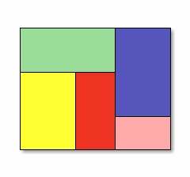
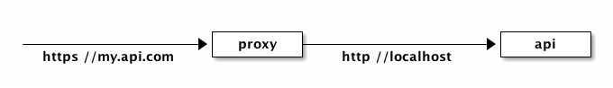

# API Gateway vs Service Mesh

Ce post a pour but de présenter les outils permettant de simplifier la mise en place d'une architecture microservices.

## La méthode old-school

Historiquement les applications métiers étaient essentiellement des applications monolithes concentrant l'intégralité des briques logicielles au sein d'un même livrable.

Au fil du temps cette approche a entraîné des contraintes de plus en plus fortes à la maintenance du projet. La base de code grossit, se complexifie et il devient alors difficile de comprendre les interactions et les règles fonctionnelles de notre application.

Au final notre monolithe va consister en un mélange de briques techniques aux responsabilités diverses ressemblant à ça:



**Responsabilités**

Au fur et à mesure qu'un monolithe grossit, des problèmes de reponsabilités vont se poser entre les différentes équipes travaillant sur des pans applicatifs communs.

**Dette technique**

Avec un monolithe, il deviendra difficile de prévoir l'impact d'une modification d'un bout de code sur l'ensemble du système. La qualité du code risque d'en pâtir et au final la qualité de l'application également.

**Veille technologique**

Enfin la possibilité d'essayer de nouvelles technologies sur un grosse application est très compliquée sans entamer une refonte totale et coûteuse du monolithe. Cela peut être une source de frustation grandissante pour les développeurs.

## Les microservices à la rescousse

Une architecture orientée micro-services vise à scinder les monolithes en briques applicatives plus petites. Ces applications peuvent alors être gérées par une seule équipe qui a la responsabilité technique et fonctionnelle totale sur celles-ci.

Dans une architecture microservices, on pourrait arriver à ça:


En adoptant ce découpage technique et fonctionnel, on peut en tirer plusieurs avantages:

**Dimensionnement**

Le dimensionnement des applications peut se faire plus facilement et plus efficacement. Seuls les services pouvant se comporter comme goulot d'étranglements pourront être sizés.

**Meilleure organisation**

Les équipes sont clairement définies et connaissent le scope sur lequel elles doivent intervenir. Elles maîtrisent l'impact de leurs développement et sont libres d'intervenir sans avoir besoin de se synchroniser avec d'autres équipes.

**Abstraction de la complexité**

En distribuant les responsabilités aux bonnes équipes, il devient facile d'abstraire la complexité d'une routine via l'exposition d'un service REST par exemple.

**Tests**

En découpant les fonctionnalités par micro service, il devient plus facile de réaliser des tests complets et de qualité.

### Des systèmes distribués

Avec des microservices, l'architecture sera de facto distribuée. Bien que localement le scope est limité et plus facile à appréhender, l'ensemble est devenu bien plus complexe.

## L'approche microservices avec Kubernetes

### Passage à Docker

La première étape pour bénéficier au maximum des avantages de la contenerisation est de convertir notre monolithe en quelque chose d'exploitable pour un orchestrateur Docker.

Le `Dockerfile` ci-dessous va nous permettre de réaliser cette transition sans modifier une seule ligne de code de notre monolithe.

```docker
# BUILD PHASE
FROM maven:3.5-jdk-8
WORKDIR /app
ADD .   /app/
RUN ["mvn", "package", "-Dmaven.test.skip=true"]

# RUN PHASE
FROM openjdk:8-jre-alpine
COPY --from=0 /app/my-app.jar ./my-app/
WORKDIR /my-app
CMD ["java", "-jar", "my-app.jar"]
```

Il suffira ensuite d'intégrer la construction d'une image basée sur ce fichier `Dockerfile` et de publier le résultat sur un registre pour la rendre accessible à tous.

### Le pattern sidecar

Notre application est compréhensible par Docker, c'est un premier point positif. Par contre il est rare qu'un monolithe déjà en production n'ait plus besoin d'évoluer.

L'adoption des microservices se fait le plus souvent en découpant un monolithe existant plutôt que sur un projet créé _from scratch_. Alors comment ajouter de nouvelles fonctionnalités sans modifier le code de l'application?

**Application**

Par exemple, on souhaite passer notre bonne vieille API en HTTPS. Naïvement on pourrait modifier notre monolithe pour y ajouter la gestion du SSL, les certificats, les headers de sécurité, ...

Une meilleure solution est d'utiliser un container dit `sidecar` qui va opérer comme un reverse proxy pour convertir des appels HTTPs en appels HTTP locaux pour notre application.



Sur la figure ci-dessus, nous n'avons plus un seul container à déployer mais **deux**. Le premier serait un container démarrant un serveur nginx dans lequel on viendrait déclarer un `proxy path` pour router tous les appels HTTPs en `my.api.com` vers notre api locale en HTTP cette fois.

**Résumé**

Le gros avantage du sidecar est qu'il est facilement réutilisable. Devoir mettre à jour l'ensemble des applications d'un SI est rapidement coûteux et difficile à tester. Appliquer ce genre de pattern permet de gagner en coût de développement et en consistence.

Le défaut, car il y en a un, de ce pattern est que désormais nous devons déployer deux containers au lieu d'un seul auparavant. Nous allons voir comment faire mieux avec Istio.

### Les service mesh avec Istio

Istio est une surcouche au dessus de Kubernetes permettant, dans un premier temps, de faciliter la transition de monolithe à microservices.

De plus Istio va proposer un ensemble de fonctionnalités très utiles pour simplifier l'usage de microservices en ce qui concerne le routage, la sécurité ou encore le suivi.

Comment Istio est capable d'ajouter toutes ces fonctionnalités à nos applications? C'est très simple, en utilisant à outrage le pattern sidecar!


Envoy est un proxy haute performance codé en C++ largement utilisé par Istio. Son but est de réguler le trafic entrant et sortant de tous les service faisant partie du service mesh (ou _réseau de services_ pour les chauvins ;) ).

Ainsi un sidecar Envoy sera déployé en même temps que nos services métier. Nos services ne communiquent qu'avec leur front proxy, les aspects de routage ou de sécurité sont entièrement délégués à Istio.

**Mise en place d'HTTPs**

Nous allons à nouveau tenter de passer des applications monolithiques en HTTPs cette fois-ci avec Istio.

**Résumé**

## Resources

 - [Designing Distributed Systems](http://shop.oreilly.com/product/0636920072768.do)
 - [L’architecture microservices sans la hype](https://blog.octo.com/larchitecture-microservices-sans-la-hype-quest-ce-que-cest-a-quoi-ca-sert-est-ce-quil-men-faut/)
 - [Docker, Kubernetes et Istio, c'est utile pour mon monolithe?](https://www.youtube.com/watch?v=YJScBvT0bxg)
 - [Kubernetes Comics](https://cloud.google.com/kubernetes-engine/kubernetes-comic/)
 - [Istio Ingress Tutorial](https://github.com/kelseyhightower/istio-ingress-tutorial)
