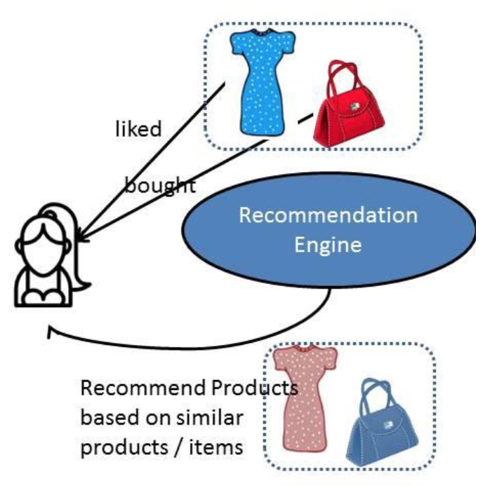
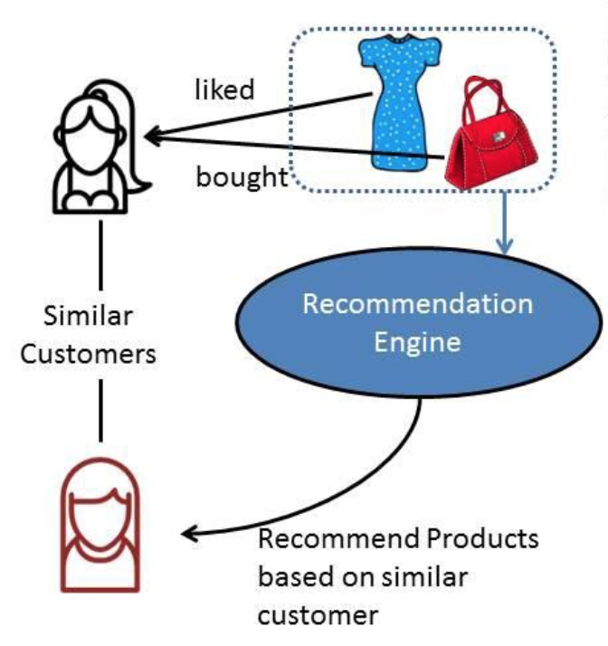
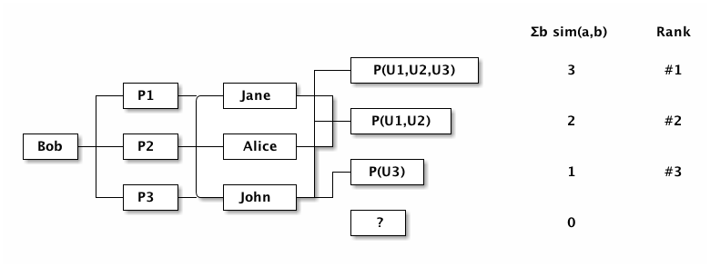
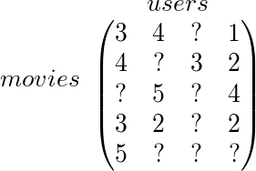
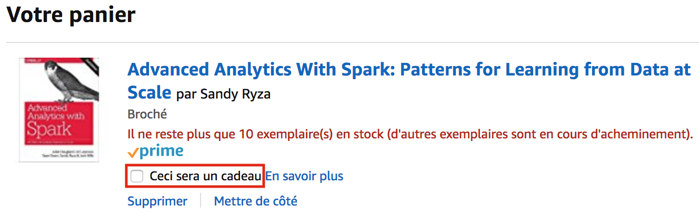

# Les moteurs de recommandations

Ce post a pour but de présenter les algorithmes mis en place dans la conception d'un moteur de recommandation.

## Enjeux

Les moteurs de recommandation sont maintenant monnaie courant sur la plupart des plate-formes que ce soit pour du ecommerce, du streaming de vidéos à la demande, ...

### Netflix

Par exemple Netflix met en avant du contenu qu'il estime intéressant pour ses utilisateurs. Le niveau de confiance de la recommandation est d'ailleurs visible:


Ici Netflix considère que la série Flash est susceptible de m'intéresser. Ce contenu sera plutôt bien mis en avant sur ma page d'accueil.

### Amazon

Amazon propose un système similaire avec néanmoins des recommandations divisées en plusieurs sections:

 - Inspirés par votre liste d'envies
 - Recommandations pour vous en %Type d'articles%
 - Inspiré de votre historique de navigation
 - ...


### Retours sur investissement

Alors quels retours sont faits de l'utilisation de ces moteurs de recommandation?

Eh bien pour Amazon, de tels systèmes permettent d'augmenter le total de ventes de **35%**. Netflix, quant à lui, estime que **2 films recommandés sur 3** sont vus suite à la recommandation.

Des recommandations pertinentes peuvent avoir un fort impact sur le volumes des ventes. Elles participent aussi à l'image de marque de l'entreprise en reflètant un niveau d'innovation elevée.

## Concepts

### Définition

Finalement comment peut-on définir un système de recommandation? Folasade Isinkaye en donne la définition suivante:

> Recommendation Engines / Recommender systems are information filtering systems that deal with the problem of information overload by filtering vital information fragment out of a large amount of dynamically generated information according to user’s preferences, interest, or observed behavior about the item. Recommendation Engines / Recommender system has the ability to predict whether a particular user would prefer an item or not based on the user’s profile

Comme expliqué ci-dessus, le but est d'estimer le comportement d'un utilisateur face à un produit en se basant sur un volume de données dynamique et filtré par préférences utilisateur.

### Machine Learning

Finalement les systèmes de recommandation ne sont qu'un sous-ensemble du machine learning.

Scikit-learn est une librairie Python proposant nombres de fonctions et d'algorithmes utilisés dans le machine learning. Il embarque en outre des exemples de jeux de données tirés de la vie réelle pour tester les algorithmes mis à disposition.

A titre d'illustration, nous allons utiliser le dataset `load_iris` comprenant des mesures d'échantillons de 3 espèces d'iris. A partir de ces données, nous allons tenter de prédire à quelle espèce appartient un nouvel échantillon et estimer le niveau de confiance de notre prédiction:

```python
import numpy as np
from sklearn.neighbors import KNeighborsClassifier
from sklearn.model_selection import train_test_split
from sklearn.datasets import load_iris

# on charge le jeu de données en mémoire
iris_dataset = load_iris()

# on partage le jeu de données en 2 (75/25):
#  - un jeu de données d'entraînement pour affiner notre algorithme
#  - un jeu de données de test pour valider notre algorithme
#
# X représente une matrice de caractéristiques de nos échantillons
# y représente l'étiquette attendue parmi:
#  - 0 => setosa
#  - 1 => versicolor
#  - 2 => virginica
X_train, X_test, y_train, y_test = train_test_split(iris_dataset['data'], iris_dataset['target'], random_state=0)

# on utilise l'algorithme des k-nearest neighbors
knn = KNeighborsClassifier(n_neighbors=1)
# on entraîne notre modèle avec le jeu d'entraînement
knn.fit(X_train, y_train)

# on simule un nouvel échantillon
X_new = np.array([[5, 2.9, 1, 0.2]])
# on demande à notre modèle de prédire l'espèce à laquelle appartient cet échantillon
prediction = knn.predict(X_new)

print(iris_dataset['target_names'][prediction])
print("Test set score: {:.2f}".format(knn.score(X_test, y_test)))

> ['setosa']
> Test set score: 0.97
```

### Parallèle

L'exemple ci-dessus est très simple et pourtant il affiche un niveau de confiance de **97%**. Les moteurs de recommandation vont marcher de façon similaire à une (**grosse**) différence près, notre jeu de données comportera des trous.

Par exemple, si l'on prend un système basé sur les avis clients il est évident que chaque utilisateur ne va pas donner un avis sur tous les produits. Nos données en entrée seront alors essentiellement _creuses_, nous travaillerons avec des matrices dites creuses.

## Algorithmes mis en place

Plusieurs algorithmes existent pour créer un moteur de recommandation. Nous allons les détailler dans cette partie.

### Filtrage sur contenu

Le filtrage basé sur contenu permet de créer un système permettant de réaliser des recommandations de produits basés sur des articles similaires déjà achetés ou bien notés du client.



Ainsi si une personne a acheté le dernier livre de J.K. Rowling le système va lui proposer un livre du même auteur ou d'un genre proche. Dans ce cas de figure, cette approche fonctionne plutôt bien car la recommandation est plutôt pertinente.

**Limites**

Par contre, elle rencontre rapidement des limites comme le fait que pour certains types d'achat proposer au client un produit similaire est totalement inutile. Imaginons que notre client achète une nouvelle machine à laver dans son enseigne préférée, lui en proposer une seconde alors qu'il vient d'en faire l'acquisition serait peu pertinent.

De plus cet algorithme souffre d'un manque de diversité. Il ne permet tout simplement pas de faire découvrir de nouveaux produits aux clients.

Enfin il nécessite un énorme travail en amont pour garder à jour notre référentiel de contenu et s'assurer que les données soient toujours de qualité. Et que fait-on si le contenu n'existe tout simplement pas? Ne doit-on faire aucune recommandation à l'utilisateur?

### Filtrage collaboratif

Le filtrage collaboratif ne se base plus directement sur le contenu mais sur les comportements d'achat.



Il en existe 2 variantes:

#### Collaboratif utilisateur

Ici on va chercher des similarités entre les utilisateurs. Ainsi si Alice a réalisé plusieurs achats communs avec Bob, alors notre système va recommander à Bob des articles achetés par Alice mais qu'il n'a lui même pas encore acheté.

On peut représenter cela sous forme de matrice avec en ligne les clients et en colonnes les produits:

|   | Stylo | m&m's | Sauce | Choux | Pizza | Lait |
| - | ----- | ----------- | -------- | -------- | ----- | ---- |
| Bob | 0 | 1 | 0 | 0 | 1 | 1 |
| Alice | 1 | 0 | 1 | 0 | 1 | 0 |
| John | 0 | 0 | 0 | 1 | 0 | 1 |
| Jane | 1 | 1 | 1 | 0 | 1 | 1 |

A partir de cette matrice, on va pouvoir réaliser une mesure de similarité pour chaque couple d'utilisateurs. Ainsi en analysant les articles achetés par Bob, on va pouvoir trouver d'autres clients ayant réalisés les même achats.



Ici, si on considère que Jane, Alice et John ont réalisé des achats similaires à ceux de Bob alors on va pouvoir repérer les achats que Bob n'a pas encore réalisé mais qui reviennent le plus souvent chez les utilisateurs similaires à Bob. En appliquant une mesure de similarité, on peut recommander à Bob les articles ayant le rang le plus elevé.

**Limites**

Le filtrage collaboratif utilisateur est rapidement coûteux. Il va nécessiter de calculer très régulièrement les similarités entre chaque couple d'utilisateurs. Si l'on prend l'exemple de Décathlon qui a près de 10 millions de client encartés, calculer leurs similarités est tout simplement impossible.

De plus, il est inopérant pour les nouveaux clients. En effet le filtrage collaboratif utilisateur se base sur des similarités d'achat entre utilisateurs. Si un nouvel utilisateur apparaît ou si un utilisateur historique n'utilisait que très rarement sa carte de fidélité alors notre moteur de recommandation sera incapable de lui recommander un article sans risquer d'être en erreur.

#### Collaboratif objet

Nous avons vu que le fitrage collaboratif basé sur contenu devenait rapidement coûteux lorsque le nombre de clients était trop important. De plus il se base sur des associations clients dont les centres d'intérêt peuvent évoluer au cours du temps.

Le filtrage collaboratif objet reprend les mêmes principes sauf qu'il ne se base plus sur des similarités d'achats entre les clients mais sur des associations entre produits. Ainsi si un masque de plongée est souvent associé à l'achat d'un tuba alors cet article sera recommandé au client qui achètera un masque de plongée.

**Avantages objet vs utilisateur**

Quels sont les avantages de ce changement dans l'algorithme? Eh bien il est beaucoup plus intéressant pour les enseignes possédant un grand nombre d'utilisateurs car les associations à calculer sont beaucoup moins importantes. De plus ces associations peuvent être pré-calculées offline et de façon moins fréquente. En effet des associations de produits seront moins susceptibles de varier au fil du temps que le comportement d'achat d'un client. Un client peut très bien être intéressé par la plongée un jour et par le tennis de table dans 6 mois.

## Alternating-Least-Squares

### Fonctionnement

La méthode ALS pour Alternating Least Squares est une autre méthode de filtrage collaboratif développée dans le cadre du Netflix Prize. Son but était de répondre à un concours lancé par Netflix pour trouver un moyen performant et efficace de déterminer une note qu'aurait donné un utilisateur sur un film.

Pour bien expliquer le fonctionnement d'ALS, résumons le problème ci-dessus sous forme de matrice:



Notre liste d'avis est une matrice à 2 dimensions avec en ligne les films et en colonne les utilisateurs. Chaque coordonnée correspond à une note donnée par un utilisateur sur un film. De nombreuses valeurs ne sont pas renseignées, notre matrice est essentiellement creuse.

L'algorithme ALS va nous permettre d'estimer la note qu'un utilisateur aurait donnée à un film afin de compléter notre modèle.

**Explicite vs Implicite**

Ici nous avons décrit un cas qui reste commode. En effet sur le cas d'utilisation qui a été décrit, le retour des utilisateurs est explicite. Dans le retail, le retour est bien plus souvent implicite (via l'achat). Le retour explicite reste cependant le vecteur d'informations le plus fiable.

De plus un retour implicite peut être trompeur surtout en période de fêtes. En effet sur une plate-forme e-commerce, rien ne nous permet de détecter si un article acheté est destiné à être offert ou non. L'intention de l'acheteur est malheureusement impossible à prévoir n'est-ce pas? Eh bien Amazon a trouvé une rustine pour détecter ce genre de cas en encourageant l'utilisateur à effectuer un retour explicite:



La coche `Ceci sera un cadeau` est une astuce d'Amazon pour éviter les retours implicites non liés à l'utilisateur courant. Amazon propose alors de fournir le papier cadeau pour emballer l'article (évidemment le but premier est de préserver le moteur de recommandation de faux positif).

### Les outils

scikit-learn ne propose pas à l'heure actuelle de modèles de système de recommandation. De nombreuses implémentations de filtrage collaboratif existent en Python comme [implicit](https://github.com/benfred/implicit).

Des solutions existent aussi dans le domaine du Big Data avec [Spark mllib](https://spark.apache.org/docs/2.2.0/mllib-collaborative-filtering.html) qui propose un filtrage collaboratif uniquement géré avec ALS.

## Resources

 - [Understanding Recommendation Engines in AI](https://medium.com/@humansforai/recommendation-engines-e431b6b6b446)
 - [Introduction to Machine Learning with Python](http://shop.oreilly.com/product/0636920030515.do)
 - [Learning Spark](http://shop.oreilly.com/product/0636920028512.do)
 - [Advanced Analytics with Spark](http://shop.oreilly.com/product/0636920056591.do)
