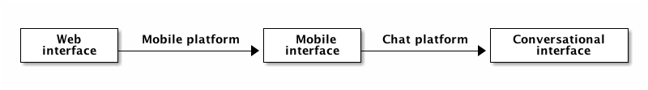
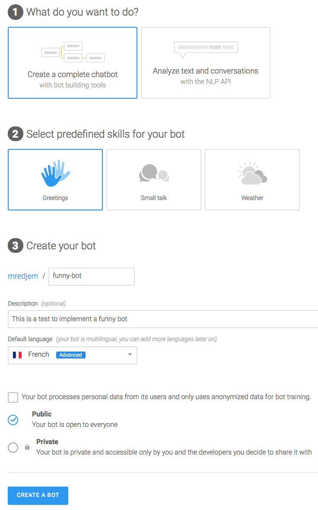
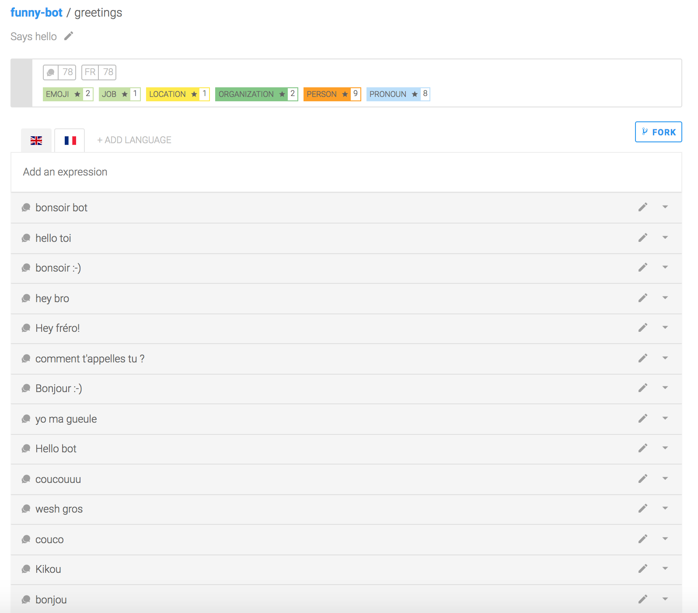
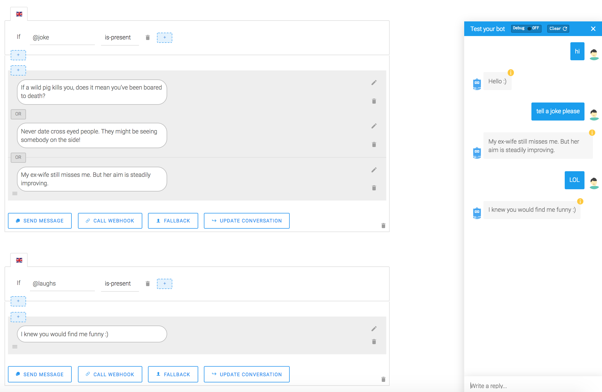
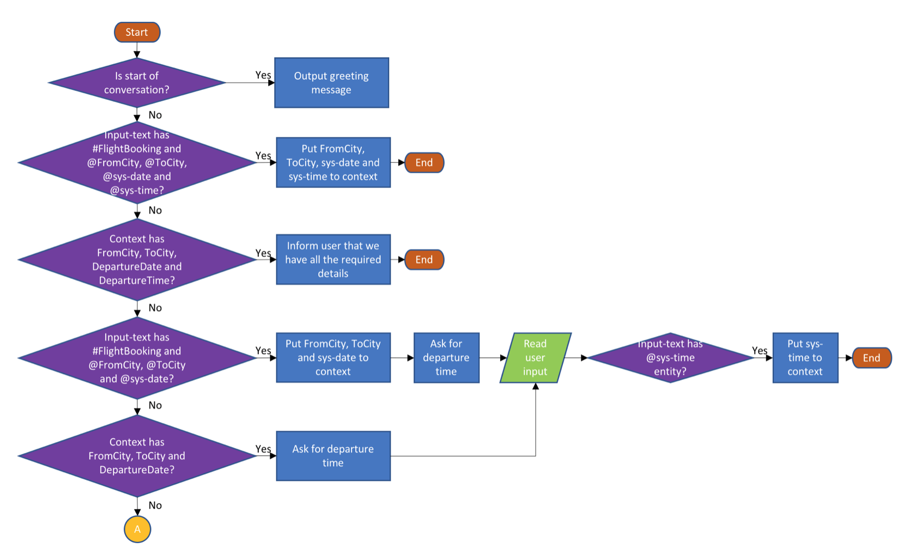

# Chatbots en 10 minutes c'est possible ?

Ce post a pour but de présenter une nouvelle façon de désigner les interfaces utilisateurs par le biais des chatbot.

## Qu'est ce qu'un chatbot ?

Au fil du temps les interfaces utilisateurs ont évolué pour fournir toujours plus d'interaction et d'originalité. Depuis les pages web classiques, l'expérience utilisateur a évolué pour s'adapter aux nouveaux médiums comme le smartphone.

Les possibilités web étant de plus en plus limités sur le mobile, les applications natives ont vu le jour avec toujours plus de fonctionnalités. Pourtant ce marché a rapidement été saturé et aujourd'hui se distinguer sur l'AppStore ou sur le PlayStore est de plus en plus compliqué.

Pourtant certains applications résistent mieux que les autres, ce sont les applications de messagerie comme Gmail, Slack, Skype, Facebook et autres. Elles ouvrent le champ à de nouvelles interfaces orientées vers le chat.



## La théorie derrière le chatbot

Bien qu'un chatbot puisse être implémentée de façon très laborieuse à coups de regex, il est en général indissociable du NLP.

Le NLP ou Natural Language Processing est un ensemble de techniques permettant d'analyser et d'extraire de l'information d'un langage structuré.

Bien que le langage soit une donnée extrêmement structurée, il est particulièrement complexe à analyser. Les raisons sont multiples:

 - la richesse de la grammaire
 - les multiples formes que peuvent prendre les mots
 - les nombreux synonymes
 - la ponctuation et les prépositions des phrases

Ce genre de problèmatique est partagé par les moteurs de recherche comme Elasticsearch qui ont également besoin de décomposer et d'analyser les entrées utilisateur pour rester le plus pertinent possible. Les chatbots utilisent également des techniques de NLP pour déterminer le sentiment véhiculé par l'utilisateur.

Voici un exemple de retour de l'API utilisée par Recast.AI lorsque l'utilisateur entre le mot `hello`:

```js
{
  "uuid": "63609b2d-770a-4a34-b323-ff8af02c7461",
  "source": "hello",
  "intents": [
    {
      "slug": "greetings",
      "confidence": 0.99,
      "description": "Says hello"
    }
  ],
  "act": "assert",
  "type": null,
  "sentiment": "vpositive",
  "entities": {},
  "language": "en",
  "processing_language": "en",
  "version": "2.12.0",
  "timestamp": "2018-06-23T19:34:29.479756+00:00",
  "status": 200
}
```

Le but du NLP est de convertir un text brut en quelque chose d'exploitable par un algorithme de machine learning à même de réaliser une prédiction. Les techniques pour arriver au résultat escompté sont nombreuses.

On considère le contenu suivant:

```
Le Lorem Ipsum est simplement du faux texte employé dans la composition et la mise en page avant impression. Le Lorem Ipsum est le faux texte standard de l'imprimerie depuis les années 1500, quand un peintre anonyme assembla ensemble des morceaux de texte pour réaliser un livre spécimen de polices de texte. Il n'a pas fait que survivre cinq siècles, mais s'est aussi adapté à la bureautique informatique, sans que son contenu n'en soit modifié. Il a été popularisé dans les années 1960 grâce à la vente de feuilles Letraset contenant des passages du Lorem Ipsum, et, plus récemment, par son inclusion dans des applications de mise en page de texte, comme Aldus PageMaker.
```

**Sentence Segmentation**

Le but est simple, décomposer un contenu brut en phrases bien distinctes:

```
Le Lorem Ipsum est simplement du faux texte employé dans la composition et la mise en page avant impression.
Le Lorem Ipsum est le faux texte standard de l'imprimerie depuis les années 1500, quand un peintre anonyme assembla ensemble des morceaux de texte pour réaliser un livre spécimen de polices de texte.
Il n'a pas fait que survivre cinq siècles, mais s'est aussi adapté à la bureautique informatique, sans que son contenu n'en soit modifié.
Il a été popularisé dans les années 1960 grâce à la vente de feuilles Letraset contenant des passages du Lorem Ipsum, et, plus récemment, par son inclusion dans des applications de mise en page de texte, comme Aldus PageMaker.
```

**Tokenization**

Cette seconde étape va permettre de décomposer une un contenu non structuré en morceaux d'information. Plusieurs implémentations existent. On peut par exemple décomposer le texte ci-dessus en se basant uniquement sur les espaces entre les termes:

```
[
'Le',
'Lorem',
'Ipsum',
'est',
'simplement',
'du',
'faux',
'texte',
'employé',
'dans',
'la',
'mise',
'en',
'page',
'avant',
'impression',
'.',
...
]
```

**StopWords**

Tous les mots ne sont pas nécessairement utiles pour qualifier notre contenu. La plupart comme `et` ou `le` n'apportent aucune information supplémentaire et sont appelés `stopwords`. Ces termes sont à filtrer pour éviter de parasiter la prise d'informations.

```
[
'Lorem',
'Ipsum',
'est',
'simplement',
'faux',
'texte',
'employé',
'mise',
'page',
'avant',
'impression',
'.',
...
]
```

**Stemming**

L'étape de stemmatisation va permettre d'appliquer une racinisation sur les tokens récupérés précedemment. Les formes plurielles ou issues d'une conjugaison spécifiques à la langue vont être supprimées pour ne garder que la racine du mot.

En appliquant ce filtre le mot `employé` pourra être mis en corrélation avec le mot `employer`.

**Lemmatization**

La lemmatisation vient en complément de la stemmatisation afin de convertir des termes dont la racine n'est pas identique.

Un article très intéressant sur ces aspects est détaillé ici:

 - [Construire un bon analyzer français pour Elasticsearch](https://jolicode.com/blog/construire-un-bon-analyzer-francais-pour-elasticsearch).

## Je veux mon chatbot !

Implémenter un chatbot "from scratch" peut être rapidement complexe. Heureusement des plate-formes existent pour simplifier et accélerer la création de bots. C'est ce que propose [Recast.AI](https://recast.ai) en metttant à disposition une plate-forme open-source pour créer un bot tout en bénéficiant de plugins développés par la communauté.

Pour la suite, nous allons créer un bot simpliste tiré du tutoriel suivant: [Build your first bot with Recast.AI](https://recast.ai/blog/build-your-first-bot-with-recast-ai/).

Créer un bot est très simple :



Une fois créé, nous pouvons constater que notre bot comprend déjà 2 intents :

 - `greetings`
 - `goodbye`

Pour chacun de ces intent, bon nombre d'expressions françaises associées sont déjà reconnues.

Par exemple un intent `greetings` est identifié par les expressions suivantes (la liste est loin d'être exhaustive) :



Des expressions qui ne sont pas listées peuvent également être ajoutées.

Nous pouvons maintenant ajouter des `Skill` à notre bot. Les `Skill` représentent les choses qu'est capable de réaliser notre bot. Par exemple, si l'on souhaite que notre bot sache raconter des blagues et réagir en conséquence, nous devons créer une nouveau `Skill`.

Les `Skill` peuvent être de 3 types différents :

 - `Business` : compétence importante
 - `Floating` : compétence anecdotique
 - `Fallback` : compétence de secours en cas d'échec de détection d'intent

Chaque compétence (`Skill`) est constituée de 4 parties :

 - `README.md`: une description de la compétence
 - `Triggers`: les raisons du déclenchement de la compétence suite à un message utilisateur
 - `Requirements`: les informations devant être récoltées et les questions à poser
 - `Actions`: les actions à prendre dès lors que les prérequis sont remplis

Par exemple, voici les actions que mon bot exécute lorsque que l'utilisateur lui demande de raconter une blague :



Lorsque que l'intent `joke` (`@` préfixe toujours un `intent`) est détecté, mon bot va répondre par une blague choisie parmi les trois propositions que j'ai indiqué. Les réponses sont ici des messages de type texte mais peuvent tout à fait être un gif, un bouton ou un template de fiche produit.

Si l'utilisateur répond par une expression connue de mon intent `laughs` alors mon bot répondra de façon invariante (et un peu lassante): `I knew you'd find me funny :)`.

Notre bot est extrêment simpliste mais il laisse déjà entrevoir tous le travail à réaliser pour le rendre le plus complet possible. Même si cela n'est pas toujours nécessaire, certains bots se basent sur des concepts d'intelligence artificielle pour gagner en pertinence. Ainsi un bot peut très bien recourir à des techniques de `Computer Vision` pour offrir de la reconnaissance d'images ou de `Machine Learning` pour proposer des réponses adaptées en fonction du contexte.

Il est également important de pouvoir monitorer son bot, un graphique en camembert avec la fréquence de détection des intent (notamment les échec de détection d'intent) permet de travailler sur l'amélioration continue du bot.

Enfin plus un bot sera sollicité avec des conversations différentes plus il sera à même de s'améliorer. C'est pourquoi il est intéressant de constituer des jeux d'entraînement et de test conséquents.

## Les outils sur le marché

Des outils existent sur le marché pour réaliser "manuellement" son propre chatbot.

Pour Python, `scikits-learn` et `spaCy` permettent respectivement de travailler sur des modèles d'apprentissage supervisés ou non et sur de la reconnaissance d'entités.

Sinon à l'instar de Recast.AI, Google propose sa plateforme pour intégrer ses chatbots avec DialogFlow:



## Resources

 - [Build your first bot with Recast.AI](https://recast.ai/blog/build-your-first-bot-with-recast-ai/)
 - [Designing Bots](http://shop.oreilly.com/product/0636920057741.do)
 - [A dive into Natural Language Processing](https://medium.com/greyatom/a-dive-into-natural-language-processing-103ae9b0a588)
